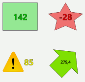
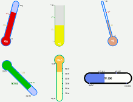

[[introduction]]
= Introduction

JFXGauge is a small library of JavaFX gauge controls.
Two skins are currently available for the gauges: a text and a thermometer skin.

[.float-group]
--
[.left.text-center]
.Text skin

[.left.text-center]
&nbsp;
[.left.text-center]
.Thermometer skin

--
